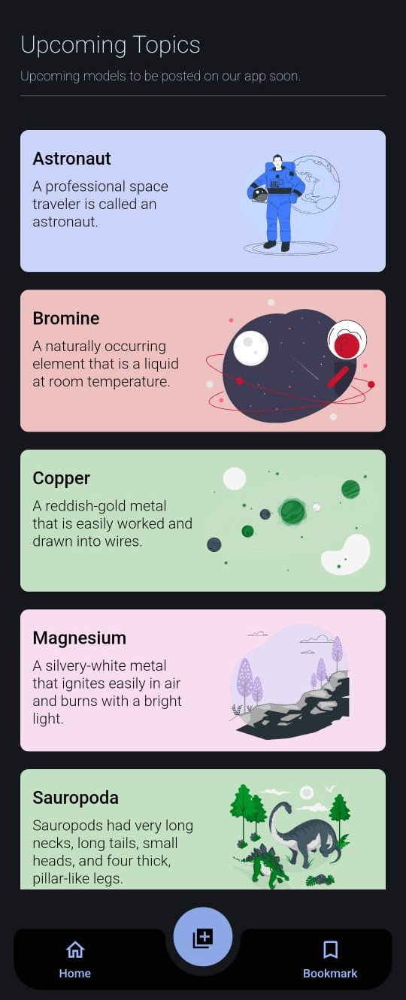
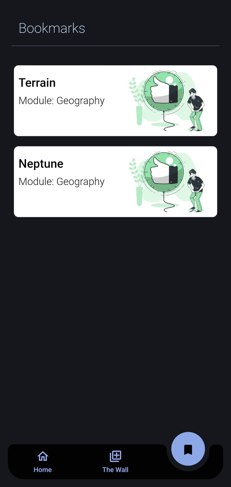
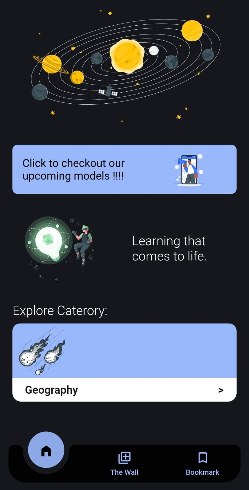
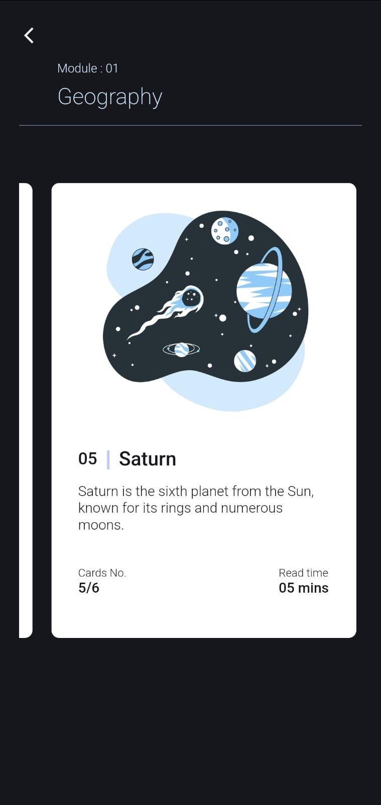
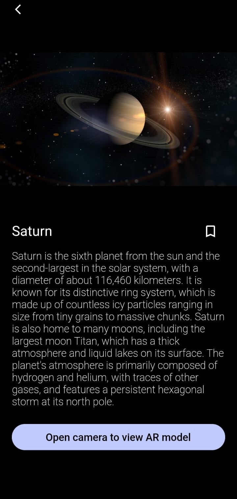
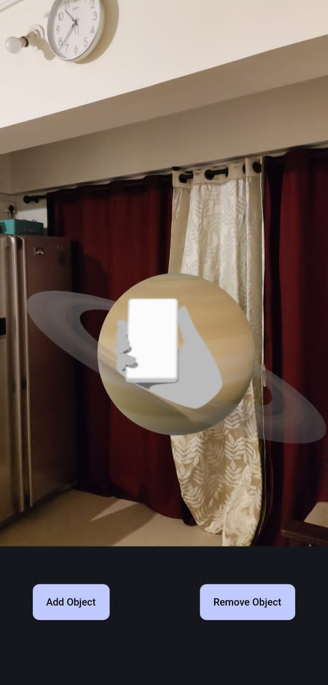
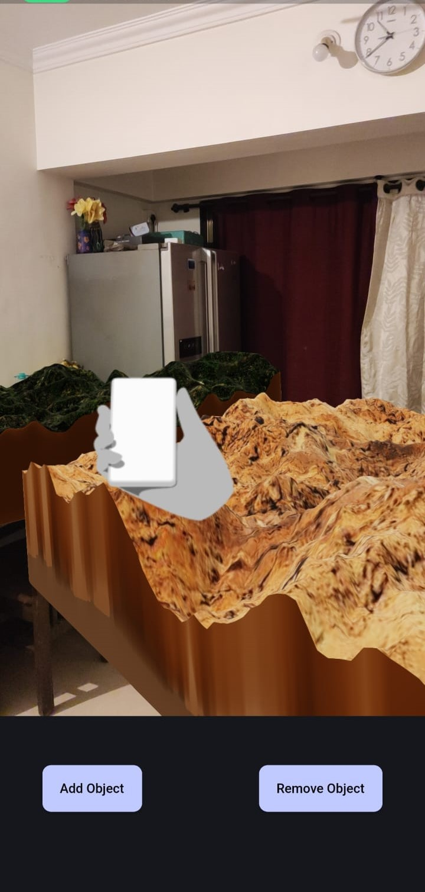

# ARena 🪐

*A Flutter application using the new ARCore* 

## 🎯 Motto 

This application offers a platform of Augmented Reality to visualize geographical elements.

## 🔺 Scale

Although the current 3D models are statically included as a list for display, it can further be done by integrating cloud storage combined with a database, similar to the rest of the app's functions to make it entirely dynamic.

## 📸 Screenshots

Upcoming Models             |  Bookmark
:-------------------------:|:----------------------:
 |  

Dashboard            |  Modules
:-------------------------:|:-------------------------:
  |  

Module Detail            |  AR Model - 1
:-------------------------:|:-------------------------:
  |  

AR Model - 2             |  AR Model - 3
:-------------------------:|:-------------------------:
  |  

